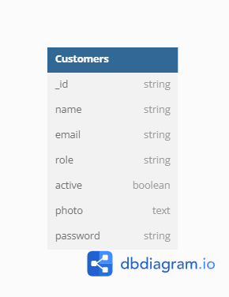

# Materi Live Coding 03/23/2024 - Advanced MongoDB

## How To Use

To run this application you need to do this on your terminal : 

```bash
# Install all the packages
$ npm install

# Run the application
$ npm start
```

## Database Diagram
